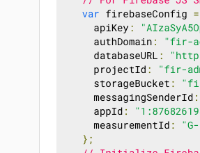
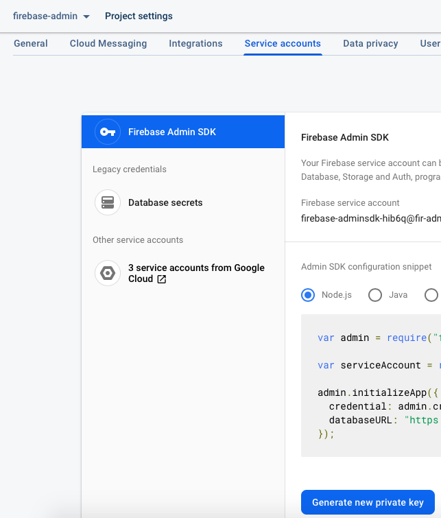
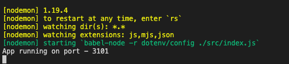
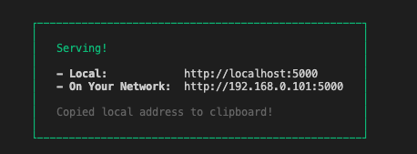

# Steps for running

### Prerequisites

Install [https://nodejs.org/en/](NodeJS LTE version)

Run the following command in terminal.

```
npm i -g serve
```

<p>&nbsp;</p>

## Setting up Firebase

Open your Firebase Console. Select your project and go to Project settings.
<br />
Select `General` tab. Scroll below and find `databaseURL` under `SDK setup and configuration`.



Copy the value and paste it in the `/backend/.env` file against key `FIREBASE_DATABASE_URL`. **Do not change the key.**

<p>&nbsp;</p>

Select Service accounts tab and click on the button `Generate new private key`. It will download a json file.



<br />
Rename the downloaded file as `serviceAcccountKey.json`.
<br />
Replace `/backend/serviceAcccountKey.json` with your new `serviceAcccountKey.json`.

<p>&nbsp;</p>

## Start backend server

From project's root directory, **open a terminal** and run the following command:

```
npm run start-backend
```

It will leave you with the below information in the terminal.


**Do not close this terminal. Otherwise backend will stop.**

<p>&nbsp;</p>

## Start frontend server

From project's root directory, **open a new terminal** and run the following command:

```
npm run start-frontend
```

It will leave you with the below information in the terminal.


**Do not close this terminal. Otherwise frontend will stop.**

<p>&nbsp;</p>

Open [http://localhost:5000](http://localhost:5000) to view it in the browser.
